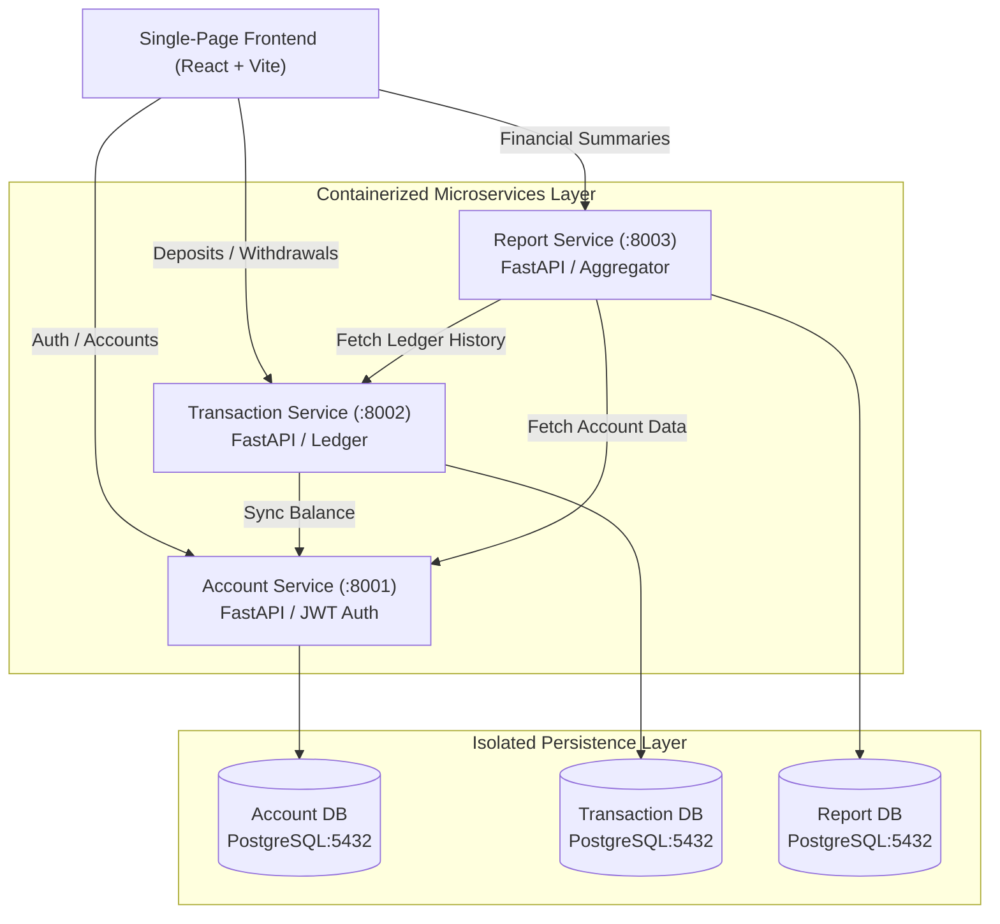

# ExpenseFlow: Microservices Architecture & DevOps Automation Pipeline

> **Core Focus**: A personal engineering project built to demonstrate **backend system design**, **microservices architecture**, **container orchestration**, and **DevOps automation (CI/CD)** workflows.

---

## 🏗️ System Architecture & Backend Design

ExpenseFlow is engineered as a decoupled, multi-tier microservices application. Each service owns its dedicated database domain, enforcing strict service isolation and independence.



---

## 🚀 Key Microservices & Responsibilities

1. **Account Service (`:8001`)**
   - User registration (`POST /accounts`), authentication (`POST /login` producing Bearer JWT tokens), profile management (`GET /accounts/me`), and balance updates (`PATCH /accounts/{id}/balance`).
   - Backed by an isolated PostgreSQL container (`account-db`).

2. **Transaction Service (`:8002`)**
   - Handles deposits and withdrawals (`POST /transactions`) and ledger history (`GET /transactions/account/{id}`).
   - Automatically synchronizes account balance adjustments via inter-service HTTP requests to the Account Service.
   - Backed by an isolated PostgreSQL container (`transaction-db`).

3. **Report Service (`:8003`)**
   - Financial report aggregator (`GET /reports/account/{id}`) fetching live metrics from both Account and Transaction services.
   - Calculates total deposits, total withdrawals, and net cash flow while persisting report execution history.
   - Backed by an isolated PostgreSQL container (`report-db`).

4. **Single-Page Frontend (`:5173`)**
   - Interactive React + Vite interface with smooth scrolling, glassmorphism aesthetics, and real-time dashboard state. *(UI design accelerated via AI)*.

---

## ⚙️ Container Orchestration & DevOps Concepts

- **Service Isolation & Health Checks**: Every microservice relies on PostgreSQL `pg_isready` health checks in `docker-compose.yml` to ensure DB readiness before service startup.
- **Bridge Network Architecture**: All containers communicate via a private Docker bridge network (`expenseflow_net`).
- **Environment Parity**: Configured with `.env.example` templates for portable, reproducible deployments across local and CI environments.
- **Decoupled API Design**: Strict CORS middleware and REST API specs enable independent service scaling and deployment.

---

## 📦 Progress & Milestones Completed

- [x] **Backend System Design**: Designed and implemented 3 decoupled Python (FastAPI) microservices.
- [x] **Database Isolation**: Configured 3 dedicated PostgreSQL containers with schemas and migration engines.
- [x] **Inter-Service Communication**: Built sync/async REST communication between Transaction, Account, and Report services.
- [x] **Docker Containerization**: Standardized Dockerfiles and multi-container `docker-compose.yml` orchestration.
- [x] **Frontend Shell**: Developed single-page React frontend with smooth scrolling and animations for dev testing (`npm run dev`).
- [ ] **CI/CD Pipeline Automation**: Automating build, linting, test suites, and deployment workflows.

---

## 🛠️ Running the Application

### 1. Start Backend Microservices & Databases
```bash
docker compose up --build
```

### 2. Start Frontend Interface
```bash
cd frontend
npm install
npm run dev
```


